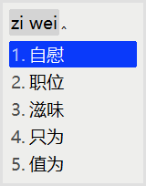
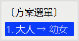
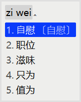

# 幼⼥输⼊法！

虽然叫输⼊法，但其实是 [rime](https://rime.im/) 的补丁啦。

安装之后可以让rime获得使⽤幼⼥Code打字的能⼒！

## 幼⼥Code是什么？

幼⼥Code是⼀款先进的反和谐⼯具，通过替换unicode中相似字形的字符，可以对付⼤部分平台对⽂本的机器审查。

项⽬链接在这⾥: <https://github.com/RimoChan/unvcode>

## 效果

使⽤前: 

接下来在⽅案选单⾥把输⼊模式从 `⼤⼈` 切换到 `幼⼥` : 

试着打⼀些词语，如果幼⼥Code⽀持这个词的话就会被翻译啦: 

## 安装⽅法

1. ⾸先你得是rime⽤户……

2. 然后clone这个仓库。

3. 把`opencc`⽂件夹的内容放进rime的程序⽂件夹。

4. 把`unv.yaml`的内容加⼊需要幼⼥code的输⼊⽅案的custom档。

5. 重新部署之后就可以打出幼⼥Code了。
